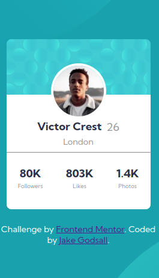
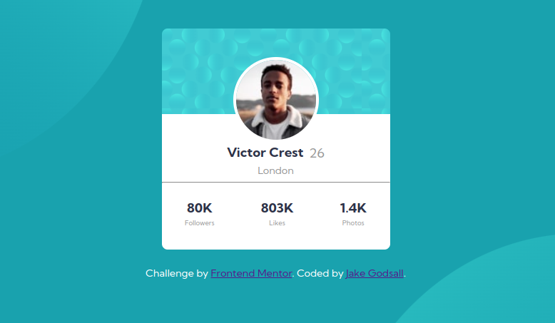

# Frontend Mentor - Profile card component solution

This is a solution to the [Profile card component challenge on Frontend Mentor](https://www.frontendmentor.io/challenges/profile-card-component-cfArpWshJ). Frontend Mentor challenges help you improve your coding skills by building realistic projects. 

## Table of contents

- [Overview](#overview)
  - [The challenge](#the-challenge)
  - [Screenshot](#screenshot)
  - [Links](#links)
- [My process](#my-process)
  - [Built with](#built-with)
  - [What I learned](#what-i-learned)
  - [Continued development](#continued-development)
  - [Useful resources](#useful-resources)
- [Author](#author)
- [Acknowledgments](#acknowledgments)

**Note: Delete this note and update the table of contents based on what sections you keep.**

## Overview

### The challenge

- Build out the project to the designs provided

### Screenshot

Here is the mobile version of the component.

and the corresponding desktop version.

### Links

- Live Site URL: [Netlify](https://your-live-site-url.com)

## My process

### Built with

- Semantic HTML5 markup
- CSS custom properties
- Flexbox
- Mobile-first workflow

### What I learned

1. That I need to use absolute height measurements for components, as different mobile screens have different heights. This was causing much of the content to be hidden because my relative units (vh) for container height weren't large enough.
2. How to use background image properties, i.e. `background-position`, `background-size` for multiple background images.
3. How to position an image over the interface between two containers using `position: relative`.

### Continued development

The CSS for this project in the end became a little unwieldy and so for the next project, I intend to try to use SASS. I shall continue to learn flexbox to get a more intuitive and natural ability for developing layouts. I intend to go through solutions given by others line for line because I do feel that my solution to this problem is very ameteur-like, and would like to start getting accustomed to best practices.

### Useful resources

- [BrowserStack Responsive](https://www.browserstack.com/responsive) - I used this tool to view the component on an array of common screen sizes. This allowed me to catch a few problems with the way I was thinking about determining size.

## Author

- Website - [Jake Godsall](https://jakegodsall.com)
- Frontend Mentor - [@jakegodsall](https://www.frontendmentor.io/profile/jakegodsall)
- LinkedIn - [@godsalljake](https://www.linkedin.com/in/godsalljake/)

**Note: Delete this note and add/remove/edit lines above based on what links you'd like to share.**

## Acknowledgments

This is where you can give a hat tip to anyone who helped you out on this project. Perhaps you worked in a team or got some inspiration from someone else's solution. This is the perfect place to give them some credit.

**Note: Delete this note and edit this section's content as necessary. If you completed this challenge by yourself, feel free to delete this section entirely.**
